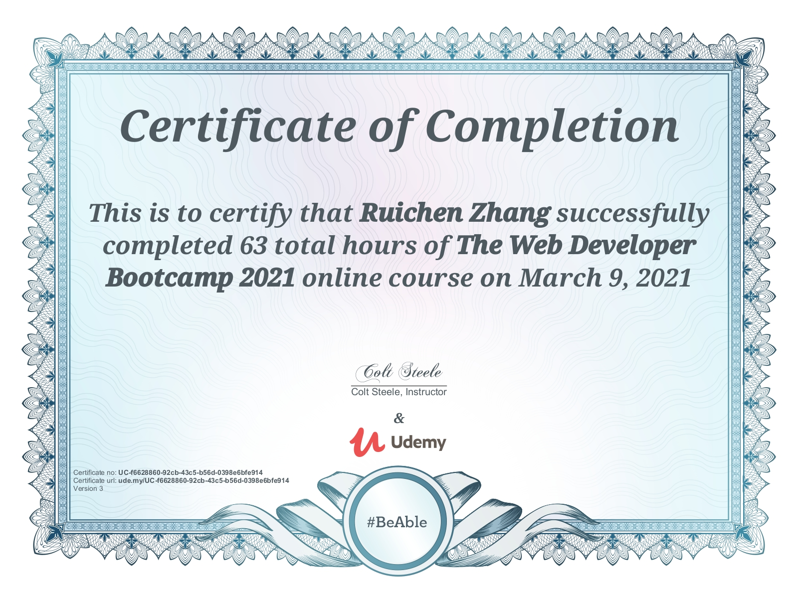

## YelpCamp

### Description
YelpCamp is a responsive website for people to share camping experience. Users can create an account and sign in to create their own campground(s) and leave review(s). This full-stack project is part of Colt Steele's web development course on Udemy. To learn more details, please see the [demo video](https://www.youtube.com/watch?v=3Gy5JuoH9Cw).

### Tools and Technologies
* <strong>Front-end: </strong>HTML5, CSS3, Bootstrap 5, JavaScript, AJAX
* <strong>Back-end: </strong>Node.js, Express, MongoDB
* <strong>User Authentification & Authorization: </strong>Passport.js
* <strong>Image Upload: </strong>Cloudinary
* <strong>Map & Geocoding: </strong>Mapbox
* <strong>Deploying App: </strong>Mongo Atlas, Heroku

### Main Features

### Certificate

 <em>Ruichen Zhang</em>
  Mar 10, 2021

